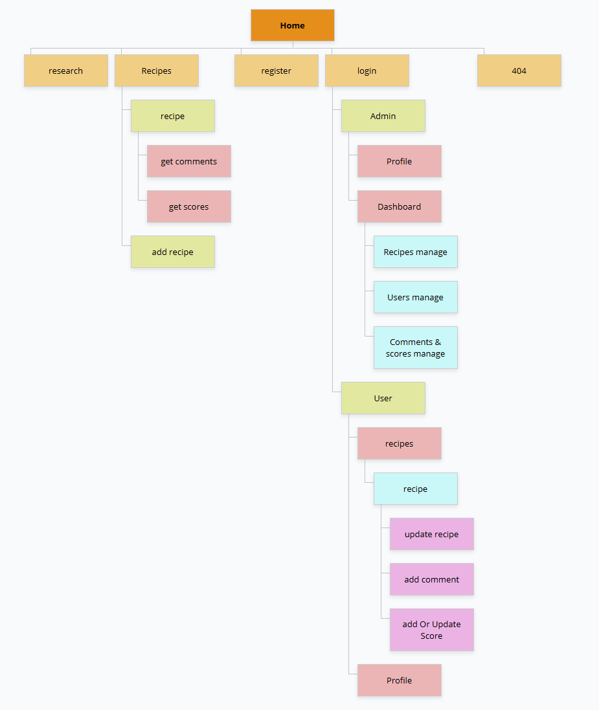

# Ciné Délices - Projet Web de Recettes Inspirées par le Cinéma et les Séries

## 1. Contexte du Projet

**Ciné Délices** est une plateforme web innovante qui combine deux passions populaires : le cinéma et la cuisine. Ce site offre une expérience immersive en permettant aux utilisateurs de découvrir des recettes inspirées des films et des séries télévisées, tout en apportant une dimension sociale et interactive à travers des fonctionnalités de partage et de gestion de contenu.

### 1. Besoins (Problèmes auxquels répond le projet)

| **Besoins**    | **Description**                              |
|----------------|----------------------------------------------|
| **Passion partagée pour le cinéma et la cuisine** | Les amateurs de cinéma et de cuisine souhaitent combiner ces deux passions dans une expérience unique.            |
| **Trouver des recettes originales** | Les utilisateurs ont besoin d'une plateforme qui leur propose des recettes inspirées de films et séries populaires. |
| **Découvrir des recettes adaptées à leurs goûts** | Besoin de filtrer et de trouver des recettes selon des critères spécifiques (type de plat, ingrédients, etc.).     |
| **Interagir avec la communauté** | Les utilisateurs souhaitent partager leurs expériences et échanger autour des recettes via des commentaires.       |
| **Accéder à des recommandations personnalisées** | Les utilisateurs veulent découvrir des recettes adaptées à leurs préférences culinaires et cinématographiques.      |
| **Gérer les recettes et les utilisateurs** | Les administrateurs doivent pouvoir gérer efficacement les recettes, catégories, et utilisateurs.                  |
| **Authentification et gestion des profils** | Les utilisateurs ont besoin de s'inscrire, se connecter, et gérer leurs informations personnelles.                |

### 2. Objectifs (Solutions qu'apporte le projet)

| **Objectifs**    | **Description**                               |
|------------------|-----------------------------------------------|
| **Plateforme de recettes inspirées du cinéma et des séries** | Offrir une expérience unique en permettant aux utilisateurs de découvrir des recettes inspirées de films et de séries. |
| **Catalogue de recettes classées par catégorie** | Permettre aux utilisateurs de naviguer facilement parmi une sélection de recettes, organisées par catégories (entrée, plat, dessert). |
| **Fonctionnalités de recherche et de filtrage** | Intégrer un moteur de recherche permettant de trouver des recettes par titre, ingrédients, catégorie, ou film/série associé. |
| **Page de détail des recettes** | Fournir des informations complètes sur chaque recette, incluant les ingrédients, les instructions, et des anecdotes ou faits intéressants. |
| **Ajout de recettes par les utilisateurs** | Permettre aux utilisateurs connectés de soumettre leurs propres recettes et de les associer à des films ou des séries. |
| **Système de gestion des utilisateurs pour les administrateurs** | Mettre en place un back-office permettant aux administrateurs de gérer les utilisateurs, modérer les recettes et gérer les catégories. |
| **Système de commentaires et de notation des recettes** | Permettre aux utilisateurs de commenter et de noter les recettes pour aider la communauté à faire des choix éclairés. |
| **Recommandations personnalisées** | Utiliser les préférences des utilisateurs pour recommander des recettes en fonction de leurs goûts culinaires et cinématographiques. |
| **Gestion sécurisée des profils utilisateurs** | Assurer l'authentification des utilisateurs et leur permettre de gérer leurs informations personnelles de manière sécurisée. |
| **Modération des contenus** | Offrir aux administrateurs les outils nécessaires pour modérer les commentaires et supprimer les contenus inappropriés. |

### 3. Public visé

Le projet **Ciné Délices** s'adresse à différents groupes d'utilisateurs qui partagent des intérêts communs pour le cinéma et la cuisine. Voici les principaux segments de public visés :

#### 1. **Les cinéphiles**
   - **Description** : Passionnés de cinéma et de séries, ce public aime explorer des aspects divers de l'univers cinématographique, y compris la cuisine inspirée par les films et les séries. Ils sont intéressés par la découverte de recettes qui leur rappellent leurs œuvres cinématographiques préférées.
   - **Besoins** :
     - Découvrir des recettes inspirées de films et de séries.
     - Accéder à des anecdotes et des informations détaillées sur les plats associés à des films ou des scènes célèbres.
     - Partager leurs propres découvertes culinaires liées à leurs films ou séries préférés.

#### 2. **Les gourmets et passionnés de cuisine**
   - **Description** : Ce groupe est constitué de personnes qui aiment cuisiner et qui sont toujours à la recherche de nouvelles recettes ou de défis culinaires. Ils sont intéressés par la création de plats inspirés par le cinéma, ou par la découverte de recettes originelles associées à des œuvres cinématographiques.
   - **Besoins** :
     - Trouver des recettes innovantes, originales et inspirées par des films ou des séries.
     - Partager leurs propres recettes avec une communauté de passionnés.
     - Recevoir des recommandations de recettes en fonction de leurs préférences culinaires.

#### 3. **Les curieux**
   - **Description** : Ce groupe inclut des utilisateurs qui ne sont ni des cinéphiles ni des gourmets passionnés, mais qui sont intéressés par des expériences nouvelles. Ils trouvent l'idée de combiner cuisine et cinéma originale et souhaitent explorer cette intersection de manière ludique.
   - **Besoins** :
     - Explorer de manière ludique un catalogue de recettes associées à des films ou des séries sans être des experts dans ces deux domaines.
     - Découvrir de nouvelles recettes de façon intuitive et divertissante, en utilisant des filtres comme les catégories ou les films/séries populaires.
     - Partager des expériences sociales en laissant des commentaires ou en notant les recettes.

#### 4. **Les administrateurs et gestionnaires de contenu**
   - **Description** : Il s'agit des utilisateurs ayant des droits d'administration sur la plateforme. Ils sont responsables de la gestion du contenu, de la modération des utilisateurs et des recettes, et de l'organisation des informations sur le site.
   - **Besoins** :
     - Accéder à un back-office pour gérer les recettes, approuver les contenus soumis par les utilisateurs, modérer les commentaires, et assurer la bonne organisation des catégories.
     - Maintenir une plateforme saine et organisée pour que l'expérience des utilisateurs soit optimale.

#### 5. **Les influenceurs et créateurs de contenu**
   - **Description** : Personnes influentes ou créateurs de contenu qui utilisent la plateforme pour partager leurs recettes ou créations en lien avec le cinéma. Ces utilisateurs peuvent être des chefs, des blogueurs culinaires ou des personnalités du monde du cinéma.
   - **Besoins** :
     - Publier et partager des recettes originales inspirées de films ou de séries populaires.
     - Gérer un profil avec une forte visibilité auprès de la communauté.
     - Interagir avec les autres utilisateurs et obtenir des retours sur leurs recettes.

------

### 2. Fonctionnalités du projet (Spécifications fonctionnelles)

Le projet **Ciné Délices** propose une plateforme permettant aux utilisateurs de découvrir, partager et gérer des recettes inspirées par le cinéma et les séries. Les fonctionnalités du projet sont définies par plusieurs besoins et cas d'utilisation, classés selon leur priorité et leur pertinence pour le lancement du projet.

#### Fonctionnalités principales

1. **Catalogue de recettes**
   - **Description** : Affichage d'une liste de recettes organisées par catégories (entrée, plat, dessert) et possibilité de filtrer selon les films/séries, popularité, ou date d'ajout.
   - **Besoins** : 
     - Filtrer les recettes par catégorie.
     - Recherche par titre, film/série ou ingrédient.
     - Affichage des recettes populaires et récentes.
   
2. **Page de détails d'une recette**
   - **Description** : Affichage des détails d'une recette, y compris les ingrédients, les instructions et l'association avec un film ou une série.
   - **Besoins** : 
     - Afficher les ingrédients et les instructions.
     - Lier une recette à un film ou une série.
     - Présenter des anecdotes ou des informations supplémentaires sur la recette et son contexte cinématographique.

3. **Système d'authentification et gestion de profil**
   - **Description** : Permettre aux utilisateurs de créer un compte, se connecter et gérer leurs informations personnelles (nom, email, mot de passe).
   - **Besoins** :
     - Création d'un compte et authentification.
     - Possibilité de modifier le profil utilisateur (nom, email, mot de passe).
     - Gérer les préférences personnelles de l'utilisateur (recommandations, notifications).

4. **Ajout de recettes**
   - **Description** : Les utilisateurs connectés peuvent soumettre de nouvelles recettes via un formulaire avec des champs pour le titre, les ingrédients, les instructions, le film/série associé, et la catégorie.
   - **Besoins** : 
     - Formulaire d'ajout de recette accessible après connexion.
     - Validation de la recette par les administrateurs avant publication.

5. **Commentaires et Notations**
   - **Description** : Permettre aux utilisateurs de laisser des commentaires et de noter les recettes avec un système d'étoiles (1 à 5).
   - **Besoins** :
     - Fonctionnalité de commentaire pour partager des avis sur les recettes.
     - Système de notation pour évaluer la qualité des recettes.

6. **Back-office d'administration**
   - **Description** : Gestion des recettes, des utilisateurs et des catégories par un administrateur. Il peut valider ou supprimer des recettes, modérer les commentaires et organiser les catégories.
   - **Besoins** :
     - Interface d'administration pour la gestion des contenus.
     - Modération des recettes et des commentaires.
     - Organisation des recettes en catégories (entrée, plat, dessert).

---

### 3. Le MVP (Minimum Viable Product)

Le **MVP (Minimum Viable Product)** est la version du produit qui inclut uniquement les fonctionnalités essentielles nécessaires pour que le projet fonctionne et soit utilisable par les utilisateurs finaux. L'objectif est de lancer rapidement un produit de base, tout en étant fonctionnel, pour pouvoir tester l'idée, recueillir des retours d'utilisateurs, et itérer sur la base de ces retours.

#### Fonctionnalités du MVP :
1. **Page d'accueil avec une liste de recettes** : Affichage de recettes classées par catégories avec une recherche basique par titre ou film/série associé.
2. **Page de détail de recette** : Affichage des détails des recettes (ingrédients, instructions).
3. **Système d'authentification** : Inscription, connexion et gestion de profil utilisateur.
4. **Ajout de recettes par les utilisateurs** : Permettre aux utilisateurs de soumettre des recettes.
5. **Commentaires et notation des recettes** : Les utilisateurs peuvent laisser des commentaires et évaluer les recettes avec un système de notation de base.
6. **Back-office d'administration basique** : L’administrateur peut valider ou supprimer les recettes et organiser les catégories.

#### Objectifs du MVP :
- Tester l'idée de base de la plateforme, c'est-à-dire la découverte de recettes inspirées par le cinéma et les séries.
- Permettre aux utilisateurs de s'inscrire, de soumettre des recettes, de commenter et de noter.
- Offrir un minimum de gestion du contenu par les administrateurs.

#### Fonctionnalités qui ne font pas partie du MVP (à développer après la phase initiale) :
- **Recommandations personnalisées** : Proposer des recettes recommandées en fonction des préférences de l'utilisateur (par exemple, basé sur les films/séries qu'ils aiment ou les ingrédients disponibles).
- **Filtrage avancé** : Recherche et filtrage plus poussés (par ingrédients, popularité, ou date d'ajout).
- **Interactions sociales** : Ajouter des fonctionnalités sociales avancées comme les likes, les partages sur les réseaux sociaux ou les abonnements aux utilisateurs.
- **Modération avancée des commentaires** : Permettre aux administrateurs de modérer les commentaires de manière plus fine (en signalant, en supprimant ou en bloquant les utilisateurs).
- **Gestion des préférences utilisateurs avancées** : Permettre aux utilisateurs de personnaliser leurs préférences de notification, de genre cinématographique ou de type de cuisine.
- **Notifications push ou email** : Envoi de notifications concernant de nouvelles recettes ou des commentaires sur les recettes de l’utilisateur.

---

### 4. Evolutions potentielles

Les **évolutions potentielles** concernent les fonctionnalités supplémentaires qui seront développées après la mise en production du MVP, en fonction des retours des utilisateurs et des besoins identifiés lors des premières itérations du projet.

#### Evolutions envisagées :
1. **Système de recommandations avancées** : 
   - Utilisation d'algorithmes pour recommander des recettes basées sur les films/séries préférés de l'utilisateur ou les ingrédients qu'il possède.
   
2. **Interface sociale complète** :
   - Permettre aux utilisateurs de suivre d'autres utilisateurs, d'aimer des recettes et de les partager sur les réseaux sociaux.
   
3. **Amélioration du système de recherche et des filtres** :
   - Ajouter des filtres avancés pour rechercher par ingrédient, difficulté, temps de préparation, etc.
   
4. **Application mobile** :
   - Développer une version mobile de la plateforme pour permettre aux utilisateurs de consulter et d’ajouter des recettes en déplacement.
   
5. **Suggestions de films et recettes** :
   - Proposer des films et séries qui sont en lien avec les recettes populaires ou nouvellement ajoutées.

6. **Gestion de l’inventaire des ingrédients** :
   - Permettre aux utilisateurs de créer un inventaire d’ingrédients et d’afficher des recettes en fonction de ce qu’ils ont à disposition.

Ces évolutions seront priorisées et développées en fonction des retours des utilisateurs et des performances du MVP.

---

## 5. Technologies Utilisées

### 1. **Frontend (Interface Utilisateur)**

#### a. **ReactJS**
- **Justification** : 
  - **React** est un des frameworks JavaScript les plus populaires et les plus performants pour construire des interfaces utilisateur interactives. Il permet de créer des interfaces dynamiques et réactives qui répondent aux actions des utilisateurs en temps réel, tout en garantissant une gestion efficace de l’état (state) de l’application.
  - Son **écosystème riche** (bibliothèques complémentaires comme React Router, Redux, etc.) et sa **vitesse de rendu** en font le choix idéal pour construire une plateforme moderne et rapide.
  - **Composantisation** : Avec React, l’interface utilisateur peut être décomposée en composants réutilisables et modulaires, ce qui améliore la maintenabilité du code et l’organisation du projet.
  
#### b. **TypeScript**
- **Justification** :
  - **TypeScript** est un sur-ensemble de JavaScript qui ajoute une couche de typage statique. Cela permet d’identifier des erreurs potentiellement coûteuses lors de la phase de développement plutôt qu’en production.
  - TypeScript offre de **meilleures pratiques de codage**, une **maintenabilité accrue** et une **compatibilité parfaite avec React**. Cela permet de réduire les bugs et d’améliorer la qualité du code, tout en facilitant la collaboration entre les développeurs.
  
#### c. **React Router**
- **Justification** :
  - **React Router** est essentiel pour la gestion de la navigation dans une application React. Il permet de créer des **routes dynamiques**, permettant ainsi de naviguer entre les différentes pages du site (par exemple, pages de recettes, d’ajout de recettes, d’inscription, etc.) sans recharger la page entière.
  - Grâce à React Router, l'application devient plus **réactive** et **rapide**, améliorant l’expérience utilisateur.
  
#### d. **SCSS**
- **Justification** :
  - **SCSS** est un **préprocesseur CSS** qui permet d'écrire des feuilles de style plus structurées et maintenables grâce à des fonctionnalités avancées comme les variables, les mixins, les fonctions, et les imbrications.
  - Il offre une **flexibilité accrue** pour personnaliser les styles de manière plus précise tout en rendant le code plus lisible et réutilisable. SCSS permet de mieux organiser les règles CSS en divisant le code en modules et en favorisant une approche modulaire.
  - **Réduction de la duplication de code** et **optimisation des styles** pour garantir une interface à la fois esthétique, fluide et facilement évolutive sur toutes les plateformes (desktop et mobile).

  

### 2. **Backend (Serveur et API)**

#### a. **Node.js**
- **Justification** :
  - **Node.js** est un environnement d'exécution JavaScript côté serveur, ce qui permet d’utiliser JavaScript aussi bien côté client que côté serveur. Cela simplifie le développement en unifiant le langage de programmation tout au long de l’application.
  - Il est **asynchrone** et basé sur un modèle d'event-loop, ce qui permet de gérer un grand nombre de requêtes simultanées avec une faible latence, idéal pour un site interactif avec des utilisateurs multiples.
  - **Scalabilité** : Node.js offre des performances élevées grâce à son architecture non-bloquante, ce qui est un atout pour gérer une application à fort trafic.

#### b. **Express.js**
- **Justification** :
  - **Express.js** est un framework minimaliste pour Node.js qui simplifie la gestion des requêtes HTTP et la création d'APIs RESTful.
  - Il permet de **structurer rapidement les endpoints** du serveur, facilitant ainsi la gestion des routes, la gestion des erreurs et la manipulation des données reçues des utilisateurs.
  - Il est également compatible avec une multitude de middlewares permettant d'ajouter des fonctionnalités (authentification, validation des données, gestion des erreurs, etc.).

#### c. **PostgreSQL**
- **Justification** :
  - **PostgreSQL** est un système de gestion de base de données relationnelle (SGBDR) robuste et open-source, qui permet de stocker et manipuler des données de manière structurée à l'aide de **tables et de relations**. Il est particulièrement adapté aux projets nécessitant des transactions complexes et des intégrités référentielles strictes, comme dans le cas de recettes où des relations entre les ingrédients, les instructions et d'autres données sont nécessaires.
  - **Flexibilité et Richesse Fonctionnelle** : PostgreSQL offre un large éventail de types de données, d'extensions et de fonctionnalités avancées (comme les vues, les index, les procédures stockées) permettant de gérer des requêtes complexes tout en maintenant une forte intégrité des données.
  - **Scalabilité** : Bien que PostgreSQL soit principalement une base de données relationnelle, il supporte également des mécanismes de partitionnement, des réplications, et des extensions comme **Citus** pour le scaling horizontal, permettant de gérer des volumes de données de plus en plus importants tout en garantissant des performances optimisées.

#### d. **MongoDB**
- **Justification** :
  - **MongoDB** est une base de données NoSQL qui permet de stocker des données sous forme de **documents JSON**. Elle est idéale pour des projets où les données peuvent être hétérogènes et évolutives, comme c’est le cas pour les recettes qui peuvent contenir des informations variées (ingrédients, instructions, liens vers des films, etc.).
  - **Flexibilité** : MongoDB offre une grande flexibilité pour ajouter de nouvelles données sans perturber la structure existante.
  - **Scalabilité** : MongoDB permet de gérer facilement des volumes de données importants et de scaler horizontalement avec une gestion simplifiée de la répartition des données.

#### e. **JSON Web Token (JWT)**
- **Justification** :
  - **JWT** est une solution standard pour gérer les sessions utilisateurs dans une application web. Il permet de créer des **tokens sécurisés** qui stockent des informations de session sur le client et assurent une communication sécurisée entre le serveur et le client.
  - Cela permet de protéger les routes sensibles (par exemple, l'ajout de recettes, l'accès au profil utilisateur) en vérifiant l'authenticité des utilisateurs via leur **token d'authentification**.
  

### 3. **Sécurité et Accessibilité**

#### a. **Helmet.js**
- **Justification** :
  - **Helmet.js** est un middleware de sécurité pour Express.js. Il permet de sécuriser l'application en définissant des en-têtes HTTP recommandés, comme la protection contre les attaques de type **Cross-Site Scripting (XSS)**, **Clickjacking**, et autres attaques liées aux en-têtes HTTP.
  
#### b. **CORS (Cross-Origin Resource Sharing)**
- **Justification** :
  - **CORS** est une norme de sécurité permettant de gérer les partages de ressources entre différentes origines (par exemple, un frontend React hébergé sur un domaine différent du backend Node.js).
  - Il permet de garantir que seules certaines origines peuvent accéder aux ressources de l'API, ce qui renforce la sécurité de l'application.

#### c. **Validation des Données**
- **Justification** :
  - L'application utilise des **validations des données côté serveur** pour éviter les attaques par injection (XSS, CSRF) et s’assurer que les données envoyées par les utilisateurs respectent un format attendu. Cela protège la base de données et l’application contre des entrées malveillantes.

### 4. **Déploiement et Conteneurisation**

#### a. **Docker**
- **Justification** :
  - **Docker** permet de **conteneuriser** l'application, ce qui garantit qu’elle fonctionnera de manière identique dans différents environnements (local, développement, production).
  - Cela facilite le déploiement et la gestion des versions, tout en offrant des avantages en termes de **scalabilité** et de **maintenance** des microservices.

#### b. **CI/CD (Intégration et Déploiement Continu)**
- **Justification** :
  - La mise en place de pipelines **CI/CD** avec des outils comme **GitHub Actions** ou **GitLab CI** permet d'automatiser les tests, la construction du projet et le déploiement en production.
  - Cela permet d'**accélérer les cycles de développement**, d’assurer une **qualité de code constante** et de déployer rapidement les nouvelles versions du produit.

### 5. **Tests**

#### a. **Jest**
- **Justification** :
  - **Jest** est un framework de test JavaScript pour tester les composants React ainsi que le backend (API Express). Il permet d'écrire des tests unitaires et d'intégration de manière efficace et simple, avec une bonne prise en charge des tests asynchrones.
  - Grâce à Jest, nous pouvons garantir que les différentes fonctionnalités du projet fonctionnent correctement avant chaque déploiement.

### 6. **Hébergement et Déploiement**

#### a. **Hostinger**
- **Justification** :
  - **Hostinger** est une plateforme d’hébergement web fiable et performante qui permet d’héberger à la fois le backend Node.js et le frontend React. Elle propose des solutions adaptées aux applications modernes et permet une gestion facile des ressources.
  - **MongoDB Atlas** ou une solution similaire peut être utilisé pour héberger la base de données **MongoDB** en cloud.
  
#### b. **SSL/TLS (Sécurisation HTTPS)**
- **Justification** :
  - L'application sera sécurisée en utilisant **HTTPS** avec un certificat **SSL/TLS** afin de garantir la confidentialité et l'intégrité des données échangées entre le serveur et les utilisateurs.

---

## 6. Navigateurs Compatibles

Afin de garantir que **Ciné Délices** soit accessible et performant sur la majorité des appareils et des configurations, il est essentiel de spécifier les navigateurs web avec lesquels l'application sera compatible. Cela permet de s'assurer que tous les utilisateurs bénéficient d'une expérience fluide, sans rencontrer de problèmes d'affichage ou de fonctionnalité.

### 1. **Navigateurs Modernes Principaux**

L'application sera compatible avec les versions récentes des navigateurs suivants :

- **Google Chrome** (dernière version stable et les deux versions précédentes)
- **Mozilla Firefox** (dernière version stable et les deux versions précédentes)
- **Safari** (dernière version stable et les deux versions précédentes, principalement pour les utilisateurs macOS et iOS)
- **Microsoft Edge** (dernière version stable et les deux versions précédentes)
- **Opera** (dernière version stable et les deux versions précédentes)

### 2. **Versions de Navigateurs Supportées**

Pour chaque navigateur, l’application prendra en charge :

- **Google Chrome** : les versions 90 et supérieures.
- **Mozilla Firefox** : les versions 90 et supérieures.
- **Safari** : les versions 14 et supérieures.
- **Microsoft Edge** : les versions 90 et supérieures.
- **Opera** : les versions 75 et supérieures.

Les versions plus anciennes de ces navigateurs peuvent ne pas prendre en charge certaines des fonctionnalités les plus récentes (par exemple, les propriétés CSS modernes, les fonctionnalités JavaScript récentes) et ne seront donc pas officiellement prises en charge.

### 3. **Navigateurs Mobiles Compatibles**

Ciné Délices étant conçu pour être **responsive** (adapté aux mobiles), il sera compatible avec les navigateurs mobiles des systèmes iOS et Android :

- **Google Chrome Mobile** (dernière version stable)
- **Safari Mobile** (dernière version stable pour iOS)
- **Samsung Internet** (dernière version stable pour les appareils Samsung)
- **Mozilla Firefox Mobile** (dernière version stable)

Les utilisateurs qui accèdent à l'application via des navigateurs obsolètes ou non mis à jour peuvent rencontrer des problèmes d'affichage ou de fonctionnalités.

### 4. **Compatibilité avec les Navigateurs de Bureau et Mobiles**

L'application étant conçue pour être **responsive** et **mobile-first**, l'interface s'adaptera automatiquement pour offrir une expérience utilisateur optimale aussi bien sur des appareils **desktop** que sur des **mobiles**. Cela comprend une adaptation fluide des éléments de l'interface (menus, images, formulaires) en fonction de la taille de l'écran.

### 5. **Exigences Techniques**

- **JavaScript** : L’application nécessitera un moteur JavaScript moderne et pleinement fonctionnel. L’utilisation de bibliothèques JavaScript comme React et des outils de gestion d’état (comme Redux) exige que le navigateur supporte les dernières normes JavaScript (ES6 et ultérieures).
- **CSS** : L'application exploitera des techniques CSS avancées, notamment **CSS Grid**, **Flexbox** et des animations CSS, qui peuvent ne pas être pleinement supportées par des navigateurs très anciens (par exemple, Internet Explorer 11 et versions antérieures).

### 6. **Navigateurs Non Compatibles**

Les navigateurs trop anciens ou moins utilisés, comme **Internet Explorer** (versions inférieures à IE 11), ou des navigateurs très spécialisés ou non standards, ne seront pas pris en charge en raison de leur incapacité à exécuter les fonctionnalités modernes nécessaires au bon fonctionnement de l'application. 

Les utilisateurs de ces navigateurs seront invités à mettre à jour leur version de navigateur pour bénéficier de l'expérience complète.

**Ciné Délices** sera conçu pour être compatible avec la majorité des navigateurs modernes, tant sur **desktop** que sur **mobile**, pour garantir une expérience utilisateur fluide et performante. L'objectif est de rendre l'application accessible au plus grand nombre d'utilisateurs tout en tenant compte des évolutions technologiques des navigateurs web.

---
## 7. Arborescence de l'Application

L'arborescence de **Ciné Délices** décrit les principales sections de l'application et les chemins que les utilisateurs suivront pour naviguer à travers les différentes pages. Elle correspond également aux **routes front-end** qui définissent les pages accessibles de l'application via le navigateur.

### 1. **Page d'Accueil**
- **Route** : `/`
- **Description** : La page principale où les utilisateurs accèdent à une vue d'ensemble des recettes populaires et peuvent naviguer par catégorie (entrée, plat, dessert).
  - **Composants principaux** :
    - Liste des recettes populaires
    - Recherche de recettes par titre ou film/série
    - Menu de navigation vers d'autres sections de l'application

### 2. **Page de Recherche**
- **Route** : `/research`
- **Description** : Permet aux utilisateurs de rechercher des recettes par titre, film/série ou catégorie.
  - **Composants principaux** :
    - Barres de recherche (par titre, par film/série, etc.)
    - Filtres de recherche (par catégorie, par ingrédients, etc.)
    - Affichage des résultats de la recherche

### 3. **Page de Détail d'une Recette**
- **Route** : `/recipe/:id`
- **Description** : Page qui affiche les détails d'une recette spécifique, y compris les ingrédients, les instructions, l'anecdote liée au film/série, et les options pour commenter ou noter la recette.
  - **Composants principaux** :
    - Détails de la recette (titre, ingrédients, instructions)
    - Film/série associé
    - Section des commentaires et des notes
    - Formulaire pour ajouter un commentaire ou une note

### 4. **Page d'Ajout de Recette** (Utilisateur connecté)
- **Route** : `/addRecipe`
- **Description** : Permet à un utilisateur connecté d'ajouter une nouvelle recette à la base de données.
  - **Composants principaux** :
    - Formulaire de saisie des informations sur la recette (titre, ingrédients, instructions, film/série associé, catégorie)
    - Bouton de soumission

### 5. **Page de Connexion / Inscription**
- **Route** : `/login` et `/register`
- **Description** : Page permettant aux utilisateurs de se connecter ou de créer un compte.
  - **Composants principaux** :
    - Formulaire de connexion avec email et mot de passe
    - Formulaire d'inscription avec champs nécessaires (email, nom, mot de passe)
    - Lien pour réinitialiser le mot de passe

### 6. **Page de Profil Utilisateur**
- **Route** : `/profile`
- **Description** : Permet aux utilisateurs de consulter et modifier leur profil.
  - **Composants principaux** :
    - Affichage des informations personnelles de l'utilisateur (nom, email, etc.)
    - Formulaire pour modifier les informations (nom, email, mot de passe)

### 7. **Page de Gestion des Utilisateurs** (Administrateur)
- **Route** : `/admin/users`
- **Description** : Page réservée aux administrateurs pour gérer les utilisateurs inscrits (activer, désactiver, supprimer des comptes).
  - **Composants principaux** :
    - Liste des utilisateurs avec actions possibles (modifier, supprimer)
    - Recherche par nom ou email

### 8. **Page de Gestion des Recettes** (Administrateur)
- **Route** : `/admin/recipes`
- **Description** : Page où les administrateurs peuvent gérer les recettes soumises par les utilisateurs (valider, supprimer, organiser en catégories).
  - **Composants principaux** :
    - Liste des recettes soumises
    - Actions sur chaque recette (valider, supprimer, organiser dans des catégories)

### 9. **Page de Gestion des Catégories** (Administrateur)
- **Route** : `/admin/categories`
- **Description** : Page permettant aux administrateurs de gérer les catégories de recettes (ajouter, supprimer, organiser).
  - **Composants principaux** :
    - Liste des catégories existantes
    - Options pour ajouter ou supprimer des catégories

### 10. **Page d'Erreur 404**
- **Route** : `/404`
- **Description** : Page affichée lorsqu'un utilisateur essaie d'accéder à une page non existante.
  - **Composants principaux** :
    - Message d'erreur indiquant que la page n'existe pas
    - Lien pour revenir à la page d'accueil

## Arborescence complète des routes :

---

## 8. Liste des Endpoints API (Noms de Routes en Anglais)

### 1. **Authentification et gestion des utilisateurs**
- **POST /api/auth/register**
  - **Description** : Créer un nouveau compte utilisateur.
  
- **POST /api/auth/login**
  - **Description** : Connexion d'un utilisateur avec email et mot de passe.

- **GET /api/auth/profile**
  - **Description** : Récupérer les informations du profil de l'utilisateur connecté.

- **PUT /api/auth/profile**
  - **Description** : Modifier les informations du profil utilisateur (nom, email, mot de passe).

### 2. **Recettes**
- **GET /api/recipes**
  - **Description** : Récupérer toutes les recettes, avec options de filtrage par catégorie, popularité, etc.

- **GET /api/recipes/:id**
  - **Description** : Récupérer les détails d'une recette spécifique.

- **POST /api/recipes**
  - **Description** : Ajouter une nouvelle recette (réservée aux utilisateurs connectés).

- **PUT /api/recipes/:id**
  - **Description** : Modifier une recette existante (réservée aux utilisateurs ayant créé la recette ou aux administrateurs).

- **DELETE /api/recipes/:id**
  - **Description** : Supprimer une recette (réservée aux utilisateurs ayant créé la recette ou aux administrateurs).

### 3. **Catégories**
- **GET /api/categories**
  - **Description** : Récupérer toutes les catégories de recettes disponibles.

- **POST /api/categories**
  - **Description** : Ajouter une nouvelle catégorie (réservée aux administrateurs).

- **PUT /api/categories/:id**
  - **Description** : Modifier une catégorie existante (réservée aux administrateurs).

- **DELETE /api/categories/:id**
  - **Description** : Supprimer une catégorie (réservée aux administrateurs).

### 4. **Commentaires**
- **POST /api/recipes/:id/comments**
  - **Description** : Ajouter un commentaire à une recette.

- **GET /api/recipes/:id/comments**
  - **Description** : Récupérer les commentaires d'une recette spécifique.

- **DELETE /api/comments/:id**
  - **Description** : Supprimer un commentaire (réservée aux administrateurs ou à l'utilisateur ayant posté le commentaire).

### 5. **Notes**
- **POST /api/recipes/:id/rating**
  - **Description** : Ajouter une note à une recette (1 à 5 étoiles).

- **GET /api/recipes/:id/rating**
  - **Description** : Récupérer la note moyenne d'une recette.

### 6. **Préférences**
- **POST /api/user/preferences**
  - **Description** : Enregistrer les préférences d'un utilisateur (type de cuisine, genre de cinéma).

- **GET /api/user/preferences**
  - **Description** : Récupérer les préférences de l'utilisateur connecté.

### 7. **Administration**
- **GET /api/admin/users**
  - **Description** : Récupérer la liste de tous les utilisateurs (réservé aux administrateurs).

- **DELETE /api/admin/users/:id**
  - **Description** : Supprimer un utilisateur (réservé aux administrateurs).

- **GET /api/admin/recipes**
  - **Description** : Récupérer toutes les recettes (réservé aux administrateurs).

- **PUT /api/admin/recipes/:id/approve**
  - **Description** : Valider une recette soumise par un utilisateur (réservé aux administrateurs).

- **DELETE /api/admin/recipes/:id**
  - **Description** : Supprimer une recette (réservé aux administrateurs).

## Résumé des principaux Endpoints

| **Méthode** | **Route**                           | **Description**                                             |
|-------------|-------------------------------------|-------------------------------------------------------------|
| POST        | /api/auth/register                  | Inscription d'un utilisateur                                |
| POST        | /api/auth/login                     | Connexion d'un utilisateur                                  |
| GET         | /api/recipes                        | Récupérer toutes les recettes                               |
| GET         | /api/recipes/:id                    | Détails d'une recette spécifique                            |
| POST        | /api/recipes                        | Ajouter une nouvelle recette                                |
| PUT         | /api/recipes/:id                    | Modifier une recette existante                              |
| DELETE      | /api/recipes/:id                    | Supprimer une recette                                       |
| POST        | /api/recipes/:id/comments           | Ajouter un commentaire à une recette                        |
| GET         | /api/recipes/:id/comments           | Récupérer les commentaires d'une recette                    |
| POST        | /api/recipes/:id/rating             | Ajouter une note à une recette                              |
| GET         | /api/recipes/:id/rating             | Récupérer la note moyenne d'une recette                     |
| POST        | /api/user/preferences               | Enregistrer les préférences d'un utilisateur                |
| GET         | /api/user/preferences               | Récupérer les préférences de l'utilisateur connecté         |
| GET         | /api/admin/users                    | Liste des utilisateurs (Administrateur)                     |
| DELETE      | /api/admin/users/:id                | Supprimer un utilisateur (Administrateur)                   |
| GET         | /api/admin/recipes                  | Liste des recettes (Administrateur)                         |
| PUT         | /api/admin/recipes/:id/approve      | Valider une recette soumise par un utilisateur (Admin)      |
| DELETE      | /api/admin/recipes/:id              | Supprimer une recette (Administrateur)                      |

---

## 9. Liste des User Stories

| **ID** | **En tant que**          | **Je souhaite**                                                                 | **Afin de**                                                                                         |
|--------|--------------------------|--------------------------------------------------------------------------------|----------------------------------------------------------------------------------------------------|
| US01   | Utilisateur              | Voir une liste de recettes classées par catégorie (entrée, plat, dessert)      | Trouver facilement des recettes qui correspondent à mes préférences culinaires.                    |
| US02   | Utilisateur              | Rechercher une recette par titre ou par film/série associé                      | Trouver rapidement une recette en fonction de mes goûts cinématographiques ou de mes films/séries favoris. |
| US03   | Utilisateur              | Voir les détails d'une recette (ingrédients, instructions, anecdotes)          | Pouvoir réaliser la recette chez moi et découvrir des anecdotes intéressantes liées au film ou à la série. |
| US04   | Utilisateur              | Créer un compte et m'authentifier                                               | Accéder à des fonctionnalités réservées aux utilisateurs inscrits (ajouter des recettes, gérer mon profil). |
| US05   | Utilisateur              | Modifier mon profil utilisateur (nom, email, mot de passe)                      | Mettre à jour mes informations personnelles si nécessaire.                                         |
| US06   | Utilisateur connecté     | Ajouter une recette à la base de données                                         | Partager mes propres recettes avec la communauté et les associer à un film ou à une série.           |
| US07   | Utilisateur connecté     | Accéder à la page "Ajouter une recette"                                         | Ajouter une nouvelle recette uniquement après m'être connecté.                                     |
| US08   | Utilisateur              | Laisser un commentaire sur une recette                                           | Partager mon avis sur une recette et interagir avec d'autres utilisateurs.                         |
| US09   | Utilisateur              | Noter une recette avec un système d'étoiles (1 à 5)                             | Donner mon avis sur la qualité de la recette et aider les autres à choisir.                         |
| US10   | Utilisateur              | Avoir accès à des recettes recommandées en fonction de mes goûts               | Découvrir des recettes suggérées par le site selon mes préférences de cinéma et de cuisine.        |
| US11   | Utilisateur              | Voir les recettes triées par popularité ou par date d'ajout                     | Trouver des recettes tendance ou récentes pour être à jour avec les nouvelles découvertes.          |
| US12   | Utilisateur              | Voir les recettes par ingrédients spécifiques                                   | Trouver des recettes en fonction des ingrédients que j'ai à ma disposition.                        |
| US13   | Administrateur           | Gérer les utilisateurs (modérer les comptes, supprimer)                        | Gérer les utilisateurs du site et contrôler l'accès aux fonctionnalités.                          |
| US14   | Administrateur           | Valider ou supprimer des recettes soumises par les utilisateurs                 | Maintenir un catalogue de recettes de qualité et supprimer celles qui ne respectent pas les critères. |
| US15   | Administrateur           | Organiser les recettes en catégories (entrée, plat, dessert, etc.)              | Faciliter la navigation et la recherche pour les utilisateurs.                                     |
| US16   | Administrateur           | Modérer les commentaires des utilisateurs                                       | Vérifier les commentaires laissés par les utilisateurs et les supprimer si nécessaire (modération). |

---

## 10. Analyse des Risques et Mesures Préventives

### 1. **Risque Technique** : Problèmes de compatibilité entre les technologies
   - **Description** : L'intégration de plusieurs technologies (ReactJS, Node.js, MongoDB, etc.) peut entraîner des incompatibilités ou des difficultés techniques pendant le développement. Cela peut aussi inclure des problèmes d'interopérabilité entre le frontend et le backend.
   - **Mesures Préventives** :
     - Choisir des technologies bien documentées et compatibles.
     - Réaliser des tests d'intégration réguliers pour s'assurer de la bonne communication entre le frontend et le backend.
     - Utiliser un environnement de développement local identique à celui de production pour minimiser les divergences.
     - Mettre en place des outils de CI/CD (Intégration continue / Déploiement continu) pour automatiser les tests d'intégration et de déploiement.

### 2. **Risque de Sécurité** : Vulnérabilités liées à la gestion des utilisateurs et des données
   - **Description** : L'application nécessite la gestion des utilisateurs et de leurs informations personnelles, ce qui peut exposer des données sensibles (comme les mots de passe) si elles sont mal protégées. Les attaques de type injection SQL, XSS ou CSRF sont également des risques potentiels.
   - **Mesures Préventives** :
     - Utiliser des pratiques sécurisées de gestion des mots de passe (hashing avec des algorithmes comme bcrypt).
     - Mettre en place un système d'authentification robuste, tel que JWT (JSON Web Token), pour sécuriser les sessions utilisateurs.
     - Intégrer des outils de sécurité comme **Helmet.js** pour sécuriser les en-têtes HTTP et **CORS** pour contrôler les accès aux ressources depuis d'autres origines.
     - Valider systématiquement toutes les entrées des utilisateurs et utiliser des mécanismes de prévention contre les injections SQL ou XSS.

### 3. **Risque de Performance** : Problèmes de scalabilité
   - **Description** : Si le nombre d'utilisateurs et de recettes sur le site augmente de manière significative, l'application peut avoir des problèmes de performance, notamment des temps de réponse lents ou des pannes liées à la surcharge des serveurs.
   - **Mesures Préventives** :
     - Utiliser des bases de données NoSQL comme MongoDB, qui sont bien adaptées pour une gestion flexible et évolutive des données.
     - Implémenter un système de cache pour les requêtes fréquentes, afin de réduire la charge sur la base de données (par exemple, avec Redis).
     - Utiliser un serveur scalable en cloud (comme AWS ou Google Cloud) pour pouvoir adapter les ressources en fonction de la charge.
     - Optimiser le code et les requêtes afin de réduire la consommation des ressources.

### 4. **Risque de Conformité Légale** : Non-conformité aux réglementations de protection des données
   - **Description** : Le projet gère des données personnelles des utilisateurs, ce qui implique de se conformer aux régulations comme le RGPD (Règlement Général sur la Protection des Données).
   - **Mesures Préventives** :
     - S'assurer que le projet respecte les exigences du RGPD (en particulier la collecte, le traitement et la suppression des données personnelles).
     - Ajouter des fonctionnalités de gestion des consentements utilisateurs (ex : consentement pour la collecte de données).
     - Protéger les données personnelles par des mécanismes de cryptage (par exemple, chiffrement des données sensibles comme les mots de passe).
     - Permettre aux utilisateurs d'exercer leurs droits sur leurs données (droit d'accès, droit à l'oubli, etc.).

### 5. **Risque de Gestion de Projet** : Retards dans le développement
   - **Description** : Le projet peut prendre du retard en raison d'une mauvaise gestion des délais, de tâches non estimées correctement ou d’imprévus techniques.
   - **Mesures Préventives** :
     - Utiliser la méthode Agile avec des sprints courts (2 semaines par exemple) pour garantir une gestion flexible et itérative.
     - Définir clairement les priorités et les fonctionnalités minimales nécessaires pour le MVP.
     - Mettre en place des revues régulières de sprint pour évaluer les progrès et ajuster les priorités.
     - Prévoir une marge de manœuvre dans les délais pour pallier les imprévus.

### 6. **Risque de UX/UI** : Mauvaise expérience utilisateur (UX) ou interface utilisateur (UI)
   - **Description** : Si le design du site n'est pas adapté ou si l'interface utilisateur est difficile à utiliser, cela peut entraîner un taux d’abandon élevé et une mauvaise adoption de la plateforme.
   - **Mesures Préventives** :
     - Réaliser des tests utilisateurs réguliers (par exemple, avec des prototypes ou des maquettes interactives) pour obtenir des retours précoces sur l'ergonomie du site.
     - Concevoir une interface simple, intuitive et responsive, adaptée aux mobiles.
     - Travailler avec un designer UI/UX pour garantir une expérience agréable et cohérente.

### 7. **Risque de Maintenance** : Difficultés à maintenir ou faire évoluer l’application
   - **Description** : Si le code n’est pas bien structuré ou documenté, il peut devenir difficile à maintenir et à faire évoluer, notamment avec l’ajout de nouvelles fonctionnalités.
   - **Mesures Préventives** :
     - Suivre les bonnes pratiques de développement et utiliser des outils comme **Prettier** pour maintenir un code propre et cohérent.
     - Utiliser des tests automatisés pour garantir que les nouvelles fonctionnalités n’introduisent pas de régressions.
     - Documenter le code et les API pour faciliter la maintenance et l'intégration de nouvelles fonctionnalités par d'autres développeurs.

### 8. **Risque de Test** : Tests insuffisants ou incomplets
   - **Description** : L'absence de tests appropriés peut entraîner des bugs et des régressions dans le produit final, particulièrement lors de l'ajout de nouvelles fonctionnalités.
   - **Mesures Préventives** :
     - Développer un ensemble de tests unitaires et d'intégration pour couvrir les fonctionnalités principales de l'application.
     - Implémenter des tests fonctionnels et des tests de performance pour vérifier la robustesse et la scalabilité de l'application.
     - Mettre en place une pipeline CI/CD pour exécuter les tests automatiquement lors de chaque mise à jour du code.

L’analyse des risques met en évidence plusieurs défis techniques, de sécurité, de gestion et de performance qui pourraient survenir au cours du développement du projet **Ciné Délices**. Cependant, avec les mesures préventives et les pratiques recommandées ci-dessus, ces risques peuvent être efficacement gérés et minimisés, garantissant ainsi une expérience utilisateur fluide et un produit final de qualité. Il est essentiel de rester vigilant tout au long du développement pour ajuster les stratégies en fonction des évolutions du projet et des retours des utilisateurs.

---

## 11. Liste des Rôles des Développeurs

### Joseph - Développeur Backend

**Responsabilités principales :**
- **Architecture Backend** : Conception et mise en place de la structure du serveur (Node.js, Express).
- **API Restful** : Développement des endpoints de l'API, gestion des routes, des méthodes HTTP (GET, POST, PUT, DELETE).
- **Base de données** : Conception et gestion de la base de données (MongoDB) — création des schémas et des modèles.
- **Authentification et Autorisation** : Mise en place du système d’authentification (JWT) et gestion des rôles des utilisateurs (utilisateur, administrateur).
- **Tests Backend** : Développement de tests unitaires et d’intégration pour garantir le bon fonctionnement des fonctionnalités backend.
- **Sécurité** : Gestion des vulnérabilités du backend, notamment en matière d’injections SQL, XSS, et protection des données sensibles.

### Julie - Développeur Frontend

**Responsabilités principales :**
- **Interface utilisateur (UI)** : Conception et développement de l’interface utilisateur en utilisant React.js.
- **Expérience utilisateur (UX)** : Assurer une expérience utilisateur fluide et intuitive, optimisation de l’ergonomie de l’application (navigation, accessibilité).
- **Consommation de l'API** : Intégration de l’API backend avec le frontend (requêtes API pour afficher les recettes, gérer les utilisateurs, etc.).
- **Gestion de l’état** : Utilisation de Redux ou Context API pour la gestion de l'état de l'application (par exemple, gestion des utilisateurs connectés, des filtres de recettes).
- **Responsiveness** : Assurer que l'application soit responsive et adaptée aux différents types d'écrans (mobile, tablette, desktop).
- **Tests Frontend** : Mise en place de tests pour vérifier le bon fonctionnement de l'interface et des composants.

### Collaboration entre Joseph et Julie

- **Intégration Frontend/Backend** : Joseph et Julie travailleront ensemble pour assurer une bonne communication entre le backend (API) et le frontend (interface utilisateur), notamment pour gérer les appels API et l’affichage dynamique des données.
- **Revue de code et QA** : Les deux développeurs procéderont à des revues de code croisées pour garantir la qualité du code et détecter les bugs.
- **Tests de bout en bout** : Joseph et Julie effectueront des tests fonctionnels pour s’assurer que l’application fonctionne correctement de bout en bout, en intégrant à la fois les aspects techniques (API et backend) et l’interface utilisateur.

---

## Résumé des Rôles

| Développeur | Rôle Principal                     | Technologies principales utilisées |
|-------------|-------------------------------------|------------------------------------|
| **Joseph**  | Développeur Backend                 | Node.js, Express, MongoDB, JWT    |
| **Julie**   | Développeur Frontend                | React.js, Redux/Context API, CSS  |

---